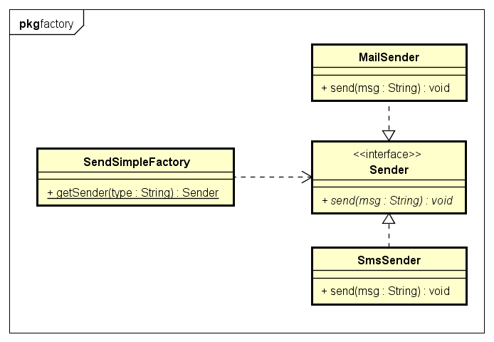

# Simple Factory 简单(静态)工厂模式

简单工厂模式:
含有一定的商业逻辑和判断逻辑，根据逻辑不同，产生具体的工厂产品,对于客户端去除了对具体产品的依赖.
对产品来说它是符合开闭原则的——对扩展开放,对修改关闭;
但是每增加一个产品,都要在工厂类中增加相应的商业逻辑和判 断逻辑,这显自然是违背开闭原则.

示例类图:


示例代码:
```java
// 产品
public interface Sender {
	public void send(String msg);
}

//具体产品
public class MailSender implements Sender {
	@Override
	public void send(String msg) {
		System.out.println("MailSender send : " + msg);
	}
}

public class SmsSender implements Sender {
	@Override
	public void send(String msg) {
		System.out.println("SmsSender  send : " + msg);
	}
}

//简单工厂
public class SendSimpleFactory {

	public static Sender getSender(String type) {
		if (null == type)
			return null;
		if ("mail".equalsIgnoreCase(type)) {
			return new MailSender();
		}
		if ("sms".equalsIgnoreCase(type)) {
			return new SmsSender();
		}
		return null;
	}

}

// 测试
public class FactoryTest {

	public static void main(String[] args) {
		simpleFactory();
	}
	
	// 简单工厂模式测试
	public static void simpleFactory() {
		Sender sender = SendSimpleFactory.getSender("sms");
		sender.send("SimpleFactory");

		SendSimpleFactory.getSender("mail").send("SimpleFactory");
	}
	
}
```

由于简单工厂模式中只有一个工厂类来对应所有产品,所以适用于业务简单的情况下或者具体产品很少增加的情况.而对于复杂的业务环境可能不太适应了,这就应该由工厂方法模式来解决。