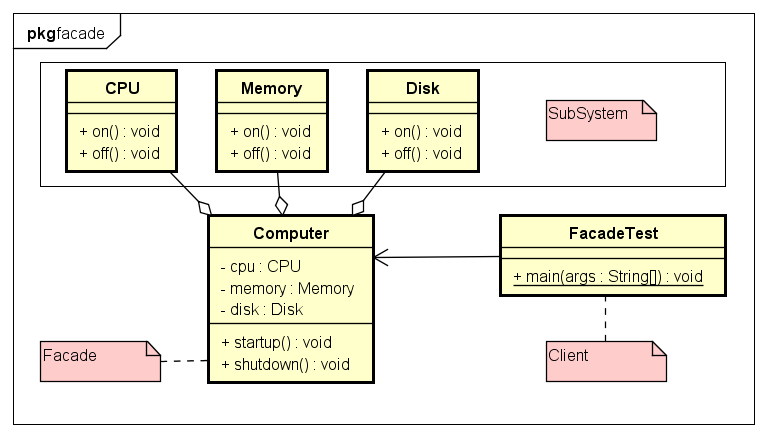
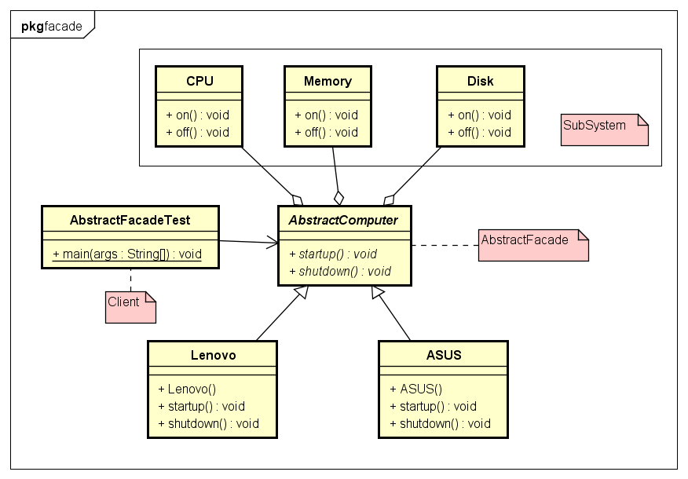

# Facade 外观模式

- 外观模式:
是软件工程中常用的一种软件设计模式，它为子系统中的一组接口提供一个统一的高层接口，使得子系统更容易使用。
外观模式是为了解决类与类之家的依赖关系的，就是将他们的关系放在一个Facade类中，降低了类类之间的耦合度，该模式中一般不涉及到接口。

- 示例类图:


- 示例代码:
```java
// SubSystem
public class CPU {
	public void on() {
		System.out.println("CPU on ...");
	}

	public void off() {
		System.out.println("CPU off ...");
	}
}
public class Memory {
	public void on() {
		System.out.println("Memory on ...");
	}

	public void off() {
		System.out.println("Memory off ...");
	}
}
public class Disk {
	public void on() {
		System.out.println("Disk on ...");
	}

	public void off() {
		System.out.println("Disk off ...");
	}
}

// Facade
public class Computer {
	private CPU cpu = new CPU();
	private Memory memory = new Memory();
	private Disk disk = new Disk();

	public void startup() {
		cpu.on();
		memory.on();
		disk.on();
		System.out.println("Computer startup ...");
	}

	public void shutdown() {
		cpu.off();
		memory.off();
		disk.off();
		System.out.println("Computer shutdown ...");
	}
}
```

- 抽象外观模式
- 外观模式最大的缺点在于违背了“开闭原则”，
当增加新的子系统或者移除子系统时需要修改外观类，可以通过引入抽象外观类在一定程度上解决该问题，客户端针对抽象外观类进行编程。
对于新的业务需求，不修改原有外观类，而对应增加一个新的具体外观类，由新的具体外观类来关联新的子系统对象，
同时通过修改配置文件来达到不修改源代码并更换外观类的目的。

- 示例类图:


- 示例代码:
```java
// SubSystem
public class CPU {
	public void on() {
		System.out.println("CPU on ...");
	}

	public void off() {
		System.out.println("CPU off ...");
	}
}
public class Memory {
	public void on() {
		System.out.println("Memory on ...");
	}

	public void off() {
		System.out.println("Memory off ...");
	}
}
public class Disk {
	public void on() {
		System.out.println("Disk on ...");
	}

	public void off() {
		System.out.println("Disk off ...");
	}
}

// Abstract Facade
public abstract class AbstractComputer {
	protected CPU cpu;
	protected Memory memory;
	protected Disk disk;

	public abstract void startup();

	public abstract void shutdown();
}
public class Lenovo extends AbstractComputer {

	public Lenovo() {
		this.cpu = new CPU();
		this.memory = new Memory();
		this.disk = new Disk();
	}

	@Override
	public void startup() {
		cpu.on();
		memory.on();
		disk.on();
		System.out.println("Lenovo startup");
	}
	@Override
	public void shutdown() {
		cpu.off();
		memory.off();
		disk.off();
		System.out.println("Lenovo shutdown");
	}
}
public class ASUS extends AbstractComputer {
	public ASUS() {
		this.cpu = new CPU();
		this.memory = new Memory();
		this.disk = new Disk();
	}

	@Override
	public void startup() {
		cpu.on();
		memory.on();
		disk.on();
		System.out.println("ASUS startup");
	}
	@Override
	public void shutdown() {
		cpu.off();
		memory.off();
		disk.off();
		System.out.println("ASUS shutdown");
	}
}
```