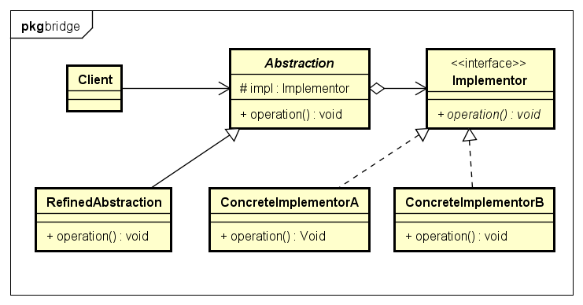
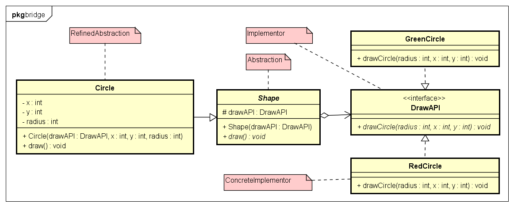

# Bridge 桥接模式

- 桥接模式:
桥接模式把事物对象和其具体行为、具体特征分离开来，使它们可以各自独立的变化。
又称为柄体(Handle and Body)模式或接口(Interface)模式。
事物对象仅是一个抽象的概念。
用意就在将抽象化与实现化解耦，使得二者可以独立变化。

- 动机
当一种抽象类型可能有多种实现方式时，一般情况我们可以考虑使用继承来解决抽象类型的多种实现，在抽象类型中定义接口，而子类负责接口的具体实现。
但这种做法缺乏灵活性，由于抽象类型和子类之间紧紧地绑定在一起，使得这种关系在运行时不能再修改，
这使得它难以修改、扩展和重用不利于抽象和实现解耦，而且这也违背OOP原则：“优先使用对象聚集，而不是继承”。

- 结构图:


1. Abstraction
抽象部分的接口。通常在这个对象里面，要维护一个实现部分的对象引用，在抽象对象里面的方法，
需要调用实现部分的对象来完成。这个对象里面的方法，通常都是跟具体的业务相关的方法。
2. RefinedAbstraction
扩展抽象部分的接口，通常在这些对象里面，定义跟实际业务相关的方法，
这些方法的实现通常会使用Abstraction中定义的方法，也可能需要调用实现部分的对象来完成。
3. Implementor:
定义实现部分的接口，这个接口不用和Abstraction里面的方法一致，通常是由Implementor接口提供基本的操作，
而Abstraction里面定义的是基于这些基本操作的业务方法，也就是说Abstraction定义了基于这些基本操作的较高层次的操作。
4. ConcreteImplementor
真正实现Implementor接口的对象。

- 示例类图:


- 示例代码:
```java
// Abstraction
public abstract class Shape {
	protected DrawAPI drawAPI;

	public Shape(DrawAPI drawAPI) {
		this.drawAPI = drawAPI;
	}

	public abstract void draw();
}

// RefinedAbstraction
public class Circle extends Shape {
	private int x, y, radius;

	public Circle(DrawAPI drawAPI, int x, int y, int radius) {
		super(drawAPI);
		this.x = x;
		this.y = y;
		this.radius = radius;
	}

	public void draw() {
		drawAPI.drawCircle(radius, x, y);
	}
}

// Implementor
public interface DrawAPI {
	public void drawCircle(int radius, int x, int y);
}
// ConcreteImplementor
public class GreenCircle implements DrawAPI {
	@Override
	public void drawCircle(int radius, int x, int y) {
		System.out.println("Drawing Circle[ color: green, radius: " + radius + ", x: " + x + ", " + y + "]");
	}
}
public class RedCircle implements DrawAPI {
	@Override
	public void drawCircle(int radius, int x, int y) {
		System.out.println("Drawing Circle[ color: red, radius: " + radius + ", x: " + x + ", " + y + "]");
	}
}
// 测试
public class BridgeTest {

	public static void main(String[] args) {
		Shape redCircle = new Circle(new RedCircle(), 100, 100, 10);
		Shape greenCircle = new Circle(new GreenCircle(), 100, 100, 10);
		redCircle.draw();
		greenCircle.draw();
	}
}
```

- 缺点：
增加了设计复杂度。
抽象类的修改影响到子类。

- 用途：
适用在需要跨多平台的图形和窗口系统。
当需要用不同的方式改变接口和实现时。
通过上述的介绍，我们了解为什么需要桥接模式（Bridge）和如何使用桥接模式（Bridge），由于对象的多维度的变化，使得难以决定变化时，我们可以把对象和变化抽象出来。
如果我们的对象依赖于抽象，对于具体的实现并不关心，我们可以通过对象组合，组合出我们想要的对象。桥接模式符合OCP（对于扩展开发，对于修改关闭）设计模式的原则。