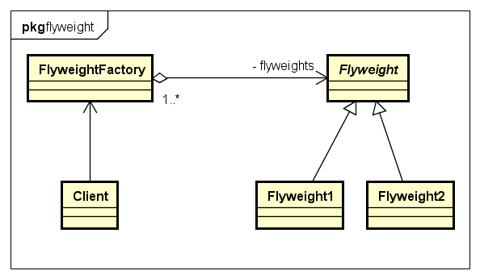
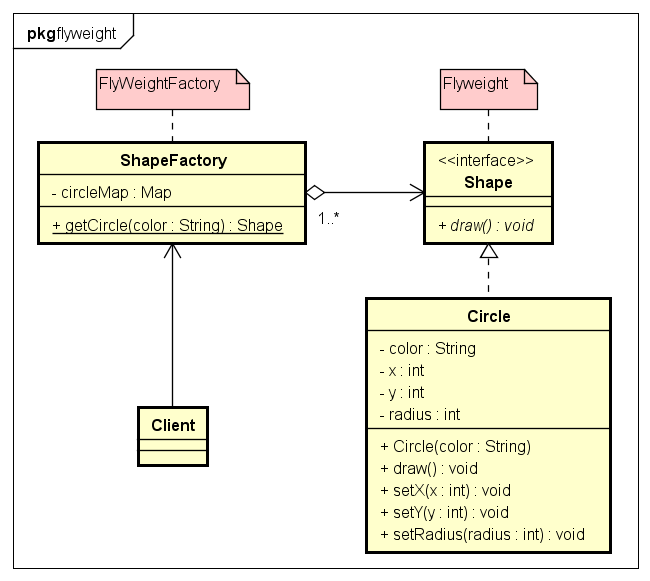

# Flyweight 享元模式

- 享元模式模式:
享元模式的主要目的是实现对象的共享，即共享池，当系统中对象多的时候可以减少内存的开销，
意图在于运用共享技术有效地支持大量细粒度的对象。通常与工厂模式一起使用。

它使用共享物件，用来尽可能减少内存使用量以及分享资讯给尽可能多的相似物件；
它适合用于当大量物件只是重复因而导致无法令人接受的使用大量内存。通常物件中的部分状态是可以分享。
常见做法是把它们放在外部数据结构，当需要使用时再将它们传递给享元。

- 结构图:


- 示例类图:


- 示例代码:
```java
public class ShapeFactory {
	private static final HashMap<String, Shape> circleMap = new HashMap<String, Shape>();

	public static Shape getCircle(String color) {
		Circle circle = (Circle) circleMap.get(color);
		if (circle == null) {
			circle = new Circle(color);
			circleMap.put(color, circle);
			System.out.println("Creating circle of color : " + color);
		}
		return circle;
	}
}

public class Circle implements Shape {
	private String color;
	private int x;
	private int y;
	private int radius;

	public Circle(String color) {
		this.color = color;
	}

	@Override
	public void draw() {
		System.out.println("Circle: Draw() [Color : " + color + ", x : " + x + ", y :" + y + ", radius :" + radius);
	}
	public void setX(int x) {
		this.x = x;
	}
	public void setY(int y) {
		this.y = y;
	}
	public void setRadius(int radius) {
		this.radius = radius;
	}
}

public class ShapeFactory {
	private static final HashMap<String, Shape> circleMap = new HashMap<String, Shape>();

	public static Shape getCircle(String color) {
		Circle circle = (Circle) circleMap.get(color);
		if (circle == null) {
			circle = new Circle(color);
			circleMap.put(color, circle);
			System.out.println("Creating circle of color : " + color);
		}
		return circle;
	}
}

public class FlyweightTest {
	static String colors[] = { "Red", "Green", "Blue", "White", "Black" };

	public static void main(String[] args) {
		for (int i = 0; i < 10; ++i) {
			Circle circle = (Circle) ShapeFactory.getCircle(getRandomColor());
			circle.setX(getRandomX());
			circle.setY(getRandomY());
			circle.setRadius(100);
			circle.draw();
		}
	}
	private static String getRandomColor() {
		return colors[(int) (Math.random() * colors.length)];
	}
	private static int getRandomX() {
		return (int) (Math.random() * 100);
	}
	private static int getRandomY() {
		return (int) (Math.random() * 100);
	}
}
```
- 适用范围:

1. 一个应用程序使用了大量的对象。 
2. 完全由于使用大量的对象，造成很大的存储开销。 
3. 对象的大多数状态都可变为外部状态。 
4. 如果删除对象的外部状态，那么可以用相对较少的共享对象取代很多组对象。 
5. 应用程序不依赖于对象标识。由于Flyweigft对象可以被共享，对于概念上明显有别的对象，标识测试将返回真值。