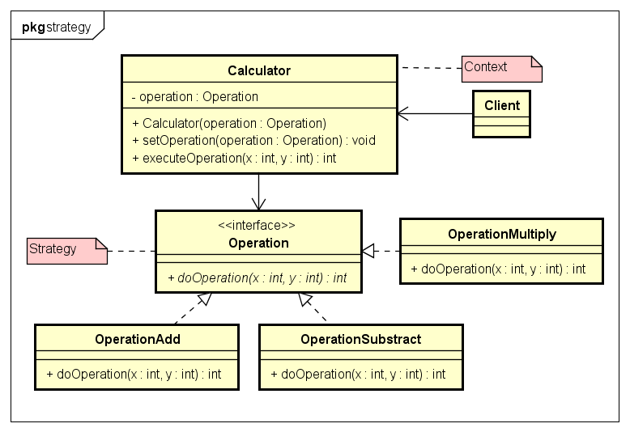

# Strategy 策略模式

- 策略模式:
也称为政策模式(Policy)。策略模式定义了一系列算法，并将每个算法封装起来，使他们可以相互替换，且算法的变化不会影响到使用算法的客户。
这些算法完成的都是相同的工作，只是实现不同，它可以以相同的方式调用所有算法，
减少各种算法类与使用类之间的耦合。

- 示例类图:


- 示例代码:
```java
// Strategy
public interface Operation {
	public int doOperation(int x, int y);
}

// ConcreteStrategy
public class OperationAdd implements Operation {
	@Override
	public int doOperation(int x, int y) {
		return x + y;
	}
}
public class OperationMultiply implements Operation {
	@Override
	public int doOperation(int x, int y) {
		return x * y;
	}
}
public class OperationSubstract implements Operation {
	@Override
	public int doOperation(int x, int y) {
		return x - y;
	}
}

// Context
public class Calculator {
	private Operation operation;

	public Calculator(Operation operation) {
		this.operation = operation;
	}

	public void setOperation(Operation operation) {
		this.operation = operation;
	}

	public int executeOperation(int x, int y) {
		return operation.doOperation(x, y);
	}
}

public class StrategyTest {

	public static void main(String[] args) {
		Calculator calculator = new Calculator(new OperationAdd());
		System.out.println(calculator.executeOperation(1000, 24));
		
		calculator.setOperation(new OperationMultiply());
		System.out.println(calculator.executeOperation(1000, 24));
	}

}
```

- 策略模式解析
策略模式是一种定义一系列算法的方法，从概念上来看，所有这些算法完成的都是相通的工作，
只是实现不同，它可以以相同的方式调用所有的算法，减少各种算法类和使用算法类之间的耦合。 
策略模式就是用来封装算法的，但是实践中，我们发现可以用它来分装几乎任何类型的规则，
只要在分析过程中听到需要在不同的时间应用不同的业务规则，就可以考虑使用策略模式处理这种变化的可能性。