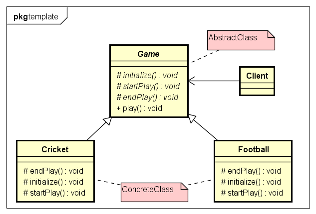

# TemplateMethod 模板方法模式

- 模板方法模式:
模板方法模式定义了一个算法的步骤，并允许子类别为一个或多个步骤提供其实践方式。
让子类别在不改变算法架构的情况下，重新定义算法中的某些步骤。


- 示例类图:


- 示例代码:
```java
// AbstractClass
public abstract class Game {
	protected abstract void initialize();

	protected abstract void startPlay();

	protected abstract void endPlay();

	// template method
	public final void play() {
		initialize();// initialize the game
		startPlay();// start game
		endPlay();// end game
	}
}

// ConcreteClass
public class Cricket extends Game {
	@Override
	protected void endPlay() {
		System.out.println("Cricket Game Finished!");
	}

	@Override
	protected void initialize() {
		System.out.println("Cricket Game Initialized! Start playing.");
	}

	@Override
	protected void startPlay() {
		System.out.println("Cricket Game Started. Enjoy the game!");
	}
}
// ConcreteClass
public class Football extends Game {
	@Override
	protected void endPlay() {
		System.out.println("Football Game Finished!");
	}

	@Override
	protected void initialize() {
		System.out.println("Football Game Initialized! Start playing.");
	}

	@Override
	protected void startPlay() {
		System.out.println("Football Game Started. Enjoy the game!");
	}
}

// 测试
public class TemplateTest {

	public static void main(String[] args) {
		Game game = new Cricket();
		game.play();

		game = new Football();
		game.play();
	}
}
```

1. AbstractClass
是一个抽象类，其实也就是一个抽象模版，定义并实现一个模版的方法。
这个模版的方法一般是一个具体的方法,它给出了一个顶级逻辑的骨架，
而逻辑组成步骤在相应的抽象操作中，推迟到子类实现。
顶级逻辑也有可能调用一些具体方法。

2. ConcreteClass
实现夫类所定义的一个或者多个抽象方法。每一个AbstractClass
都可以有任意多个ConcreteClass与之对应，而每一个ConcreteClass
都可以给出这些抽象方法(也就是顶级逻辑的组成步骤)的不同实现，从而使得顶级逻辑的实现各不相同。

> 模版方法模式是通过把不变的行为搬移到超类，去除子类中的重复代码来体现它的优势。
当不变的和可变的行为在方法的子类实现中混合在一起的时候，不变的行为就会在子类中重复出现。
我们通过模版方法模式把这些行为版已到单一的地方，这样就帮助子类摆脱重复的不变的行为的纠缠。