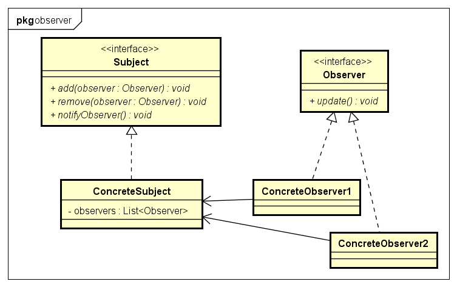
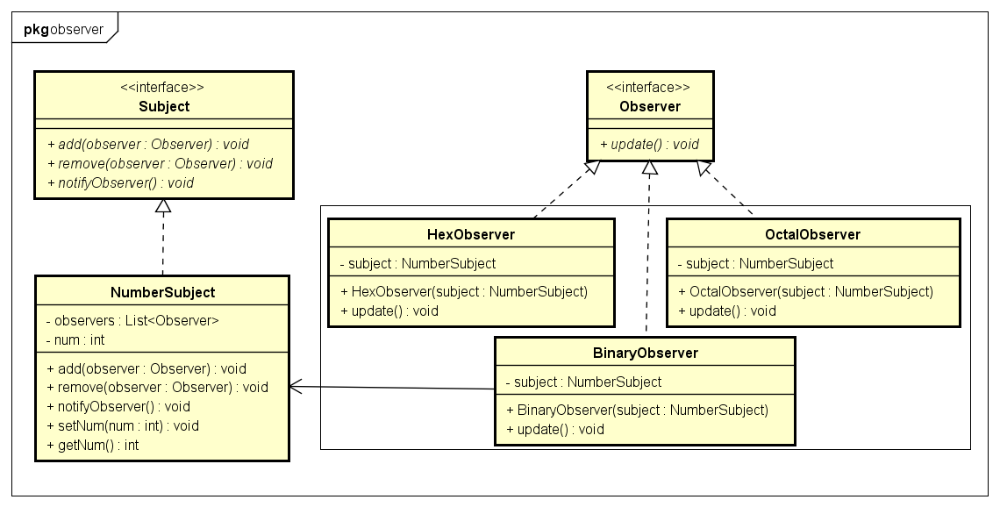

# Observer 观察者模式

- 观察者模式:
观察者模式定义了一种一对多的依赖关系，让多个观察者对象同时监听某一个主题对象。
这个主题对象在状态发生变化时，会通知所有观察者对象，使它们能够自动更新自己。观察者模式是一种对象行为型模式。

- 观察者模式的别名包括:
发布-订阅(Publish/Subscribe)模式, 模型-视图(Model/View)模式,
源-监听器(Source/Listener)模式, 从属者(Dependents)模式。

- 结构图:


- 示例类图:


- 示例代码:
```java
public interface Subject {
	public void add(Observer observer);

	public void remove(Observer observer);

	public void notifyObserver();
}
// ConcreteSubject
public class NumberSubject implements Subject {
	private List<Observer> observers = new ArrayList<Observer>();

	private int num;

	@Override
	public void add(Observer observer) {
		if (!observers.contains(observer))
			observers.add(observer);
	}

	@Override
	public void remove(Observer observer) {
		observers.remove(observer);
	}

	@Override
	public void notifyObserver() {
		for (Observer observer : observers) {
			observer.update();
		}
	}

	public void setNum(int num) {
		this.num = num;
		notifyObserver();// notifyObserver
	}

	public int getNum() {
		return num;
	}
}

public interface Observer {
	public void update();
}
// ConcreteObserver
public class BinaryObserver implements Observer {
	private NumberSubject subject;

	public BinaryObserver(NumberSubject subject) {
		this.subject = subject;
		subject.add(this);
	}

	@Override
	public void update() {
		System.out.println("Binary:" + Integer.toBinaryString(subject.getNum()));
	}
}
public class OctalObserver implements Observer {
	private NumberSubject subject;

	public OctalObserver(NumberSubject subject) {
		this.subject = subject;
		subject.add(this);
	}

	@Override
	public void update() {
		System.out.println("Octal:" + Integer.toOctalString(subject.getNum()));
	}
}
public class HexObserver implements Observer {
	private NumberSubject subject;

	public HexObserver(NumberSubject subject) {
		this.subject = subject;
		subject.add(this);
	}

	@Override
	public void update() {
		System.out.println("Hex:" + Integer.toHexString(subject.getNum()).toUpperCase());
	}
}

// 测试
public class ObserverTest {
	public static void main(String[] args) {
		NumberSubject subject = new NumberSubject();

		new BinaryObserver(subject);
		new OctalObserver(subject);
		new HexObserver(subject);
		
		subject.setNum(10);
		subject.setNum(1024);
	}
}
```

1. 抽象主题(Subject)：
它把所有观察者对象的引用保存到一个聚集里，每个主题都可以有任何数量的观察者。
抽象主题提供一个接口，可以增加和删除观察者对象。

2. 具体主题(ConcreteSubject)：
将有关状态存入具体观察者对象；在具体主题内部状态改变时，给所有登记过的观察者发出通知。

3. 抽象观察者(Observer)：
为所有的具体观察者定义一个接口，在得到主题通知时更新自己。

4.具体观察者(ConcreteObserver)：
实现抽象观察者角色所要求的更新接口，以便使本身的状态与主题状态协调。

- 优点
观察者模式解除了主题和具体观察者的耦合，让耦合的双方都依赖于抽象，而不是依赖具体。从而使得各自的变化都不会影响另一边的变化。

- 缺点
依赖关系并未完全解除，抽象通知者依旧依赖抽象的观察者。

- 适用场景
1.  当一个对象的改变需要给变其它对象时，而且它不知道具体有多少个对象有待改变时。
2. 一个抽象某型有两个方面，当其中一个方面依赖于另一个方面，这时用观察者模式可以将这两者封装在独立的对象中使它们各自独立地改变和复用。