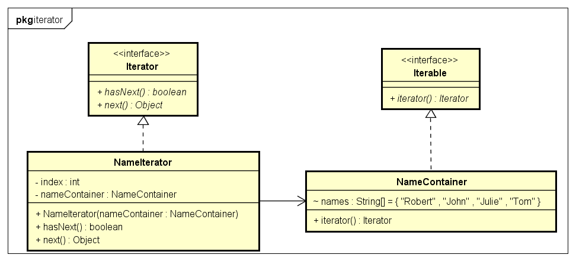

# Iterator 迭代器模式

- 迭代器模式:
迭代器模式就是顺序访问聚集中的对象，一般来说，集合中非常常见，如果对集合类比较熟悉的话，理解本模式会十分轻松。
这句话包含两层意思：一是需要遍历的对象，即聚集对象，二是迭代器对象，用于对聚集对象进行遍历访问

- 示例类图:


- 示例代码:
```java
public interface Iterator {
	public boolean hasNext();
	public Object next();
}

public interface Iterable {
	public Iterator iterator();
}

public class NameContainer implements Iterable {
	String names[] = { "Robert", "John", "Julie", "Tom" };

	@Override
	public Iterator iterator() {
		return new NameIterator(this);
	}
}

public class NameIterator implements Iterator {
	private NameContainer nameContainer;
	private int index;

	public NameIterator(NameContainer nameContainer) {
		this.nameContainer = nameContainer;
	}

	@Override
	public boolean hasNext() {
		if (index < nameContainer.names.length) {
			return true;
		}
		return false;
	}

	@Override
	public Object next() {
		if (hasNext()) {
			return nameContainer.names[index++];
		}
		return null;
	}
}

// 测试
public class IteratorTest {

	public static void main(String[] args) {
		Iterable iterable = new NameContainer();

		Iterator iterator = iterable.iterator();
		while (iterator.hasNext()) {
			System.out.println(iterator.next());
		}
	}
}
```