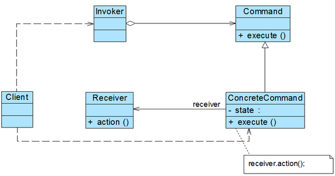
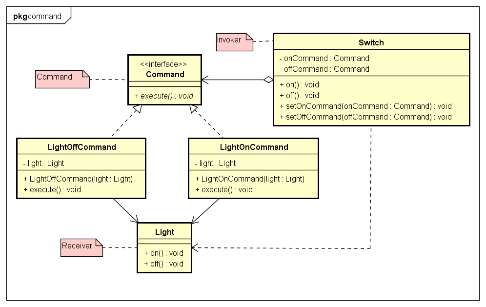

# Command 命令模式

- 命令模式:
将一个请求封装为一个对象，从而使你可用不同的请求对客户进行参数化，
对请求排队或者纪录请求日志，以及支持可撤销的操作。

- 结构图:


- 示例类图:


- 示例代码:
```java
// Command
public interface Command {
	public void execute();
}

// Invoker
public class Switch {
	private Command onCommand;
	private Command offCommand;

	public Switch() {
	}
	public Switch(Command onCommand, Command offCommand) {
		this.onCommand = onCommand;
		this.offCommand = offCommand;
	}
	public void on() {
		onCommand.execute();
	}
	public void off() {
		offCommand.execute();
	}
	public void setOnCommand(Command onCommand) {
		this.onCommand = onCommand;
	}
	public void setOffCommand(Command offCommand) {
		this.offCommand = offCommand;
	}
}

// Receiver
public class Light {
	public void on() {
		System.out.println("The light is on");
	}

	public void off() {
		System.out.println("The light is off");
	}
}
public class LightOnCommand implements Command {
	private Light light;

	public LightOnCommand(Light light) {
		this.light = light;
	}

	@Override
	public void execute() {
		light.on();
	}
}
public class LightOffCommand implements Command {
	private Light light;

	public LightOffCommand(Light light) {
		this.light = light;
	}

	@Override
	public void execute() {
		light.off();
	}
}
```

1. Client创建一个ConcreteCommand对象并指定他的Receiver对象。
2. 某个Invoker对象存储该ConcreteCommand对象。
3. 该Invoker通过调用Command对象的Execute操作来提交一个请求。
若该命令是可撤销的，ConcreteCommand就在执行Execute操作之前存储当前状态以用于取消该命令。
4. ConcreteCommand对象对调用它的Receiver的一些操作以执行该请求。

- 优点

1.降低对象之间的耦合度。
2.新的命令可以很容易地加入到系统中。
3.可以比较容易地设计一个组合命令。

- 缺点
使用命令模式可能会导致某些系统有过多的具体命令类。因为针对每一个命令都需要设计一个具体命令类，
因此某些系统可能需要大量具体命令类，这将影响命令模式的使用。

