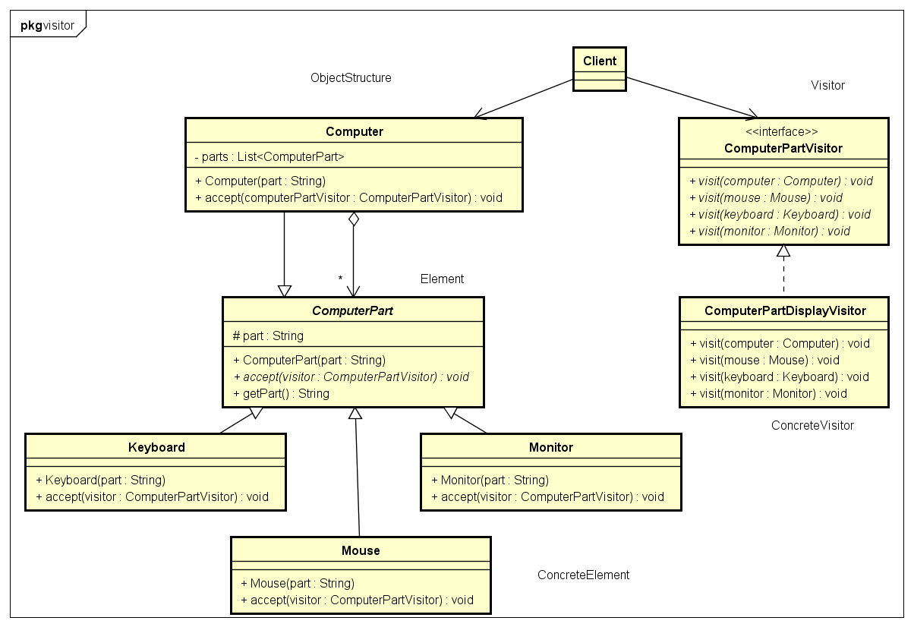

# Visitor 访问者模式

- Visitor模式:
提供一个作用于某对象结构中的各元素的操作表示，它使我们可以在不改变各元素的类的前提下定义作用于这些元素的新操作。
访问者模式是一种将算法与对象结构分离的软件设计模式。访问者模式是一种对象行为型模式。


- 结构图:


- 示例类图:


- 示例代码:
```java
// Visitor
public interface ComputerPartVisitor {
	public void visit(Computer computer);
	public void visit(Mouse mouse);
	public void visit(Keyboard keyboard);
	public void visit(Monitor monitor);
}

// ConcreteVisitor
public class ComputerPartDisplayVisitor implements ComputerPartVisitor {
	@Override
	public void visit(Computer computer) {
		System.out.println("Displaying " + computer.getPart());
	}

	@Override
	public void visit(Mouse mouse) {
		System.out.println("Displaying " + mouse.getPart());
	}

	@Override
	public void visit(Keyboard keyboard) {
		System.out.println("Displaying " + keyboard.getPart());
	}

	@Override
	public void visit(Monitor monitor) {
		System.out.println("Displaying " + monitor.getPart());
	}
}

// Element
public abstract class ComputerPart {
	protected String part;

	public ComputerPart(String part) {
		this.part = part;
	}

	public abstract void accept(ComputerPartVisitor computerPartVisitor);

	public String getPart() {
		return part;
	}
}

// ConcreteElement
public class Keyboard extends ComputerPart {
	
	public Keyboard(String part) {
		super(part);
	}

	@Override
	public void accept(ComputerPartVisitor computerPartVisitor) {
		computerPartVisitor.visit(this);
	}
}
public class Monitor extends ComputerPart {
	
	public Monitor(String part) {
		super(part);
	}

	@Override
	public void accept(ComputerPartVisitor computerPartVisitor) {
		computerPartVisitor.visit(this);
	}
}
public class Mouse extends ComputerPart {
	
	public Mouse(String part) {
		super(part);
	}

	@Override
	public void accept(ComputerPartVisitor computerPartVisitor) {
		computerPartVisitor.visit(this);
	}
}

// ObjectStructure
public class Computer extends ComputerPart {
	private ComputerPart[] parts;

	public Computer(String part) {
		super(part);
		this.parts = new ComputerPart[] { new Mouse("Mouse"), new Keyboard("Keyboard"), new Monitor("Monitor") };
	}

	@Override
	public void accept(ComputerPartVisitor computerPartVisitor) {
		for (int i = 0; i < parts.length; i++) {
			parts[i].accept(computerPartVisitor);
		}
		computerPartVisitor.visit(this);
	}
}

// 测试
public class VisitorTest {

	public static void main(String[] args) {
		ComputerPart computer = new Computer("Computer");
		ComputerPartVisitor visitor = new ComputerPartDisplayVisitor();

		computer.accept(visitor);
	}
}
```

- 角色:

1. Vistor(抽象访问者):
抽象访问者为对象结构中每一个具体元素类ConcreteElement声明一个访问操作，
从这个操作的名称或参数类型可以清楚知道需要访问的具体元素的类型，具体访问者需要实现这些操作方法，定义对这些元素的访问操作。

2. ConcreteVisitor(具体访问者):
具体访问者实现了每个由抽象访问者声明的操作，每一个操作用于访问对象结构中一种类型的元素。


3. Element(抽象元素):
抽象元素一般是抽象类或者接口，它定义一个accept()方法，该方法通常以一个抽象访问者作为参数。

4. ConcreteElement(具体元素):
具体元素实现了accept()方法，在accept()方法中调用访问者的访问方法以便完成对一个元素的操作。

5. ObjectStructure(对象结构):
对象结构是一个元素的集合，它用于存放元素对象，并且提供了遍历其内部元素的方法。它可以结合组合模式来实现，
也可以是一个简单的集合对象，如一个List对象或一个Set对象。


- 缺点:

1. 增加新的元素类很困难,在访问者模式中，每增加一个新的元素类都意味着要在抽象访问者角色中增加一个新的抽象操作，
并在每一个具体访问者类中增加相应的具体操作，违背了“开闭原则”的要求。

2. 破坏封装,当采用访问者模式的时候，就会打破组合类的封装。
