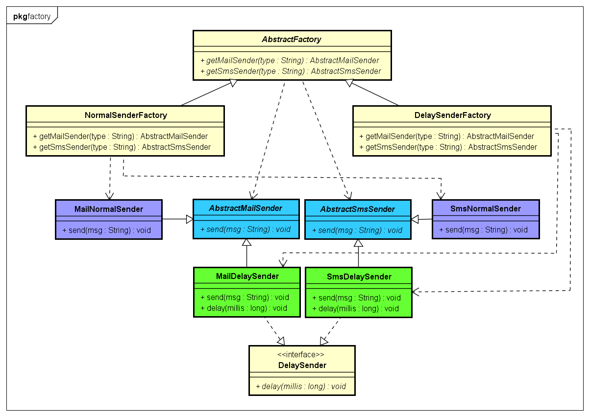
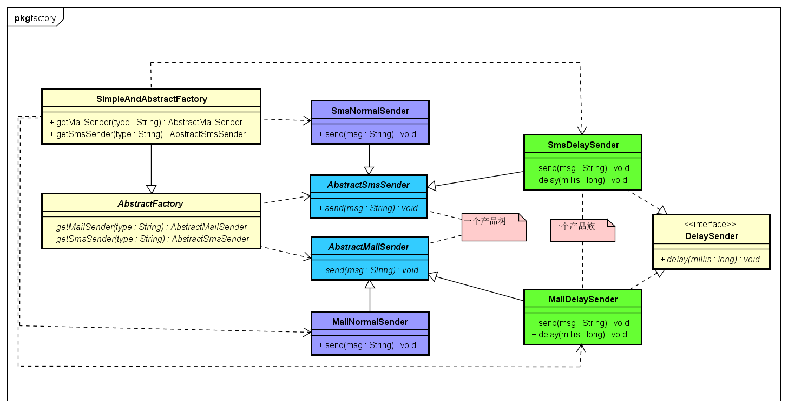

# Abstract Factory 抽象工厂模式

抽象工厂模式:
它和工厂方法模式的区别就在于需要创建对象的复杂程度上。而且抽象工厂模式是三个里面最为抽象,最具一般性的。
抽象工厂模式的用意为：给客户端提供一个接口，可以创建多个产品族中的产品对象。

示例类图:


示例代码:
```java
// 产品树
public abstract class AbstractMailSender {
	public abstract void send(String msg);
}
public abstract class AbstractSmsSender {
	public abstract void send(String msg);
}

//具体产品族1
public class MailNormalSender extends AbstractMailSender {
	@Override
	public void send(String msg) {
		System.out.println("MailNormalSender  send : " + msg);
	}
}
public class SmsNormalSender extends AbstractSmsSender {
	@Override
	public void send(String msg) {
		System.out.println("SmsNormalSender  send : " + msg);
	}
}

//具体产品族2
public interface DelaySender {
	public void delay(long millis);
}

public class MailDelaySender extends AbstractMailSender implements DelaySender {
	@Override
	public void send(String msg) {
		delay(500);
		System.out.println("MailDelaySender  send : " + msg);
	}

	@Override
	public void delay(long millis) {
		try {
			Thread.sleep(millis);
		} catch (InterruptedException e) {
		}
	}
}
public class SmsDelaySender extends AbstractSmsSender implements DelaySender {
	@Override
	public void send(String msg) {
		delay(500);
		System.out.println("SmsDelaySender  send : " + msg);
	}

	@Override
	public void delay(long millis) {
		try {
			Thread.sleep(millis);
		} catch (InterruptedException e) {
		}
	}
}

// 定义抽象工厂
public abstract class AbstractFactory {
	public abstract AbstractMailSender getMailSender(String type);

	public abstract AbstractSmsSender getSmsSender(String type);
}

// 一个产品族具体实现
public class NormalSenderFactory extends AbstractFactory{
	@Override
	public AbstractMailSender getMailSender(String type) {
		return new MailNormalSender();
	}

	@Override
	public AbstractSmsSender getSmsSender(String type) {
		return new SmsNormalSender();
	}
}
public class DelaySenderFactory extends AbstractFactory{
	@Override
	public AbstractMailSender getMailSender(String type) {
		return new MailDelaySender();
	}

	@Override
	public AbstractSmsSender getSmsSender(String type) {
		return new SmsDelaySender();
	}
}

//测试
public class FactoryTest {

	public static void main(String[] args) {
		AbstractFactory();
	}

	// 抽象工厂模式测试
	public static void AbstractFactory() {
		// normal产品族
		AbstractFactory normalSenderFactory = new NormalSenderFactory();
		AbstractMailSender normalMailSender = normalSenderFactory.getMailSender(null);
		normalMailSender.send("NormalSenderFactory");
		AbstractSmsSender normalSmsSender = normalSenderFactory.getSmsSender(null);
		normalSmsSender.send("NormalSenderFactory");
		// delay产品族
		AbstractFactory delaySenderFactory = new DelaySenderFactory();
		delaySenderFactory.getMailSender(null).send("DelaySenderFactory");
		delaySenderFactory.getSmsSender(null).send("DelaySenderFactory");
	}

}

```

抽象工厂模式的缺点：如果需要增加新的产品树，那么就要新增三个类,
比如:AbstractOtherSender,OtherNormalSender,OtherDelaySender.
并且要修改三个工厂类,这样大批量的改动是不希望的。

当然可以用简单工厂或反射来改进抽象工厂。

- 简单工厂+抽象工厂:

示例类图:


示例代码:
```java
// 产品代码与上面一致
   ...

// 定义抽象工厂
public abstract class AbstractFactory {
	public abstract AbstractMailSender getMailSender(String type);

	public abstract AbstractSmsSender getSmsSender(String type);
}
// 简单工厂+抽象工厂
public class SimpleAndAbstractFactory extends AbstractFactory {

	@Override
	public AbstractMailSender getMailSender(String type) {
		if (null == type)
			return null;
		AbstractMailSender mailSender = null;
		if ("normal".equalsIgnoreCase(type)) {
			mailSender = new MailNormalSender();
		}
		if ("delay".equalsIgnoreCase(type)) {
			mailSender = new MailDelaySender();
		}
		return mailSender;
	}

	@Override
	public AbstractSmsSender getSmsSender(String type) {
		if (null == type)
			return null;
		AbstractSmsSender smsSender = null;
		if ("normal".equalsIgnoreCase(type)) {
			smsSender = new SmsNormalSender();
		}
		if ("delay".equalsIgnoreCase(type)) {
			smsSender = new SmsDelaySender();
		}
		return smsSender;
	}

}

// 简单工厂配合抽象工厂测试
public static void SimpleAndAbstractFactory() {
	SimpleAndAbstractFactory simpleAndAbstractFactory = new SimpleAndAbstractFactory();
	// normal产品族
	AbstractMailSender normalMailSender = simpleAndAbstractFactory.getMailSender("normal");
	normalMailSender.send("SimpleAndAbstractFactory");
	AbstractSmsSender normalSmsSender = simpleAndAbstractFactory.getSmsSender("normal");
	normalSmsSender.send("NormalSenderFactory");
	// delay产品族
	simpleAndAbstractFactory.getMailSender("delay").send("SimpleAndAbstractFactory");
	simpleAndAbstractFactory.getSmsSender("delay").send("SimpleAndAbstractFactory");
}
```