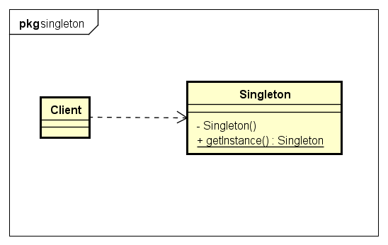

# Singleton 单例模式


单例模式:
1. 单例类只能有一个实例。
2. 单例类必须自己创建自己的唯一实例。
3. 单例类必须给所有其他对象提供这一实例。

- 好处:
1. 某些类创建比较频繁，对于一些大型的对象，这是一笔很大的系统开销。
2. 省去了new操作符，降低了系统内存的使用频率，减轻GC压力。
3. 有些类如交易所的核心交易引擎，控制着交易流程，如果该类可以创建多个的话，系统完全乱了。（比如一个军队出现了多个司令员同时指挥，肯定会乱成一团），所以只有使用单例模式，才能保证核心交易服务器独立控制整个流程。


示例类图:


示例代码:

1. 饿汉式(线程安全)
```java
//饿汉式单例类.在类初始化时，已经自行实例化 
public class Singleton {
    private static final Singleton INSTANCE = new Singleton();
	private Singleton() {}
    public static Singleton getInstance() {
        return INSTANCE;
    }
}
```
这种方式基于classloder机制避免了多线程的同步问题。

2. 懒汉式(线程不安全)
```java
public class Singleton {
    private static Singleton instance;
    private Singleton (){}

    public static Singleton getInstance() {
	if (instance == null) {
	    instance = new Singleton();
	}
	return instance;
    }
}
```
达到了lazy loading的效果，但是致命的是在多线程不能正常工作。

3. 懒汉式(线程安全)
```java
public class Singleton {
    private static Singleton instance;
    private Singleton (){}

    public static synchronized Singleton getInstance() {
	if (instance == null) {
	    instance = new Singleton();
	}
	return instance;
    }
}
```
达到了lazy loading的效果且线程安全，但是效率低每次都做了不必要的同步。

4. 双重校验锁 DCL(懒汉式,线程安全)
```java
public class Singleton {
    private volatile static Singleton singleton;
    private Singleton (){}
    public static Singleton getSingleton() {
	if (singleton == null) {
	    synchronized (Singleton.class) {
			if (singleton == null) {
			    singleton = new Singleton();
			}
	    }
	}
	return singleton;
    }
}
```

5. 静态内部类(懒汉式,线程安全)
```java
public class Singleton {
    private static class SingletonHolder {
		private static final Singleton INSTANCE = new Singleton();
    }
    private Singleton (){}
    public static final Singleton getInstance() {
		return SingletonHolder.INSTANCE;
    }
}
```
利用了classloder的机制来保证初始化instance时只有一个线程,与第1种有所区别，这种达到了lazy loading效果。

6. 枚举(饿汉,线程安全)
```java
public enum Singleton {
    INSTANCE;
    public void otherMethod() {
    }
}
```
不仅能避免多线程同步问题，而且还能防止反序列化重新创建新的对象。enum是jdk5新加入的,继承至Enum的类都为final,且不能继承其他类,equals,hashCode,compareTo等部分方法不能重写。

7. 容器实现单例模式
```java
public class SingletonManager {
	private static Map<String, Object> objMap = new HashMap<String, Object>();

	private SingletonManager() {
	}

	public static void registerService(String key, Object instance) {
		if (!objMap.containsKey(key)) {
			objMap.put(key, instance);
		}
	}

	public static Object getService(String key) {
		return objMap.get(key);
	}
}
```
用SingletonManager 将多种的单例类统一管理，在使用时根据key获取对象对应类型的对象。
这种方式使得我们可以管理多种类型的单例，并且在使用时可以通过统一的接口进行获取操作，降低了用户的使用成本，也对用户隐藏了具体实现，降低了耦合度。


## 注意
如果Singleton实现了java.io.Serializable接口，那么这个类的实例就可能被序列化和复原。不管怎样，如果序列化一个单例类的对象，接下来复原多个那个对象，那就会有多个单例类的实例了。
- 解决方法: 加入readResolve()方法。
```java
public class Singleton implements Serializable {
	private static final long serialVersionUID = 1L;

	private Singleton() {
	}

	public void otherMethod() {
	}

	private static class SingletonHolder {
		private static final Singleton INSTANCE = new Singleton();
	}

	public static Singleton getInstance() {
		return SingletonHolder.INSTANCE;
	}
	/**
	 * {@see java.io.Serializable}
	 */
	private Object readResolve() throws ObjectStreamException {
		return getInstance();
	}
}
```