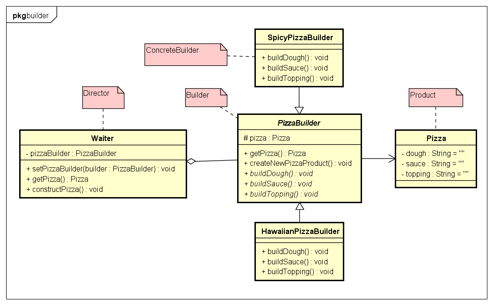

# Builder 建造者模式

- 建造者模式:
建造者模式主要是用于创建一些复杂的对象，这些对象内部构建间的建造顺序是稳
定的，但是对象内部的构建通常面临着复杂的变化。
好处就是使得建造代码与表示代码分离，由于建造者隐藏了改产品是
如何组装的，所以若需要改变一个产品的内部表示，只需要再定义一个具体的建造
者就可以了。

- 与抽象工厂的区别：
在建造者模式里，有个指导者，由指导者来管理建造者，用户是与指导者联系的，指导者联系建造者最后得到产品。即建造模式可以强制实行一种分步骤进行的建造过程。

- 适用场景
1. 需要生成的产品对象有复杂的内部结构，这些产品对象通常包含多个成员属性。
2. 隔离复杂对象的创建和使用，并使得相同的创建过程可以创建不同的产品。

-  缺点
1. 建造者模式所创建的产品一般具有较多的共同点，其组成部分相似，如果产品之间的差异性很大，则不适合使用建造者模式，因此其使用范围受到一定的限制。
2. 如果产品的内部变化复杂，可能会导致需要定义很多具体建造者类来实现这种变化，导致系统变得很庞大。

示例类图:



示例代码:
```java
// Product
public class Pizza {
	private String dough = "";
	private String sauce = "";
	private String topping = "";

	public void setDough(String dough) {
		this.dough = dough;
	}
	public void setSauce(String sauce) {
		this.sauce = sauce;
	}
	public void setTopping(String topping) {
		this.topping = topping;
	}

	@Override
	public String toString() {
		return "Pizza [dough=" + dough + ", sauce=" + sauce + ", topping=" + topping + "]";
	}
}

// Abstract Builder
public abstract class PizzaBuilder {
	protected Pizza pizza;

	public Pizza getPizza() {
		return pizza;
	}

	public void createNewPizzaProduct() {
		pizza = new Pizza();
	}

	public abstract void buildDough();

	public abstract void buildSauce();

	public abstract void buildTopping();
}

// ConcreteBuilder 1
public class HawaiianPizzaBuilder extends PizzaBuilder {
	@Override
	public void buildDough() {
		pizza.setDough("cross");
	}
	@Override
	public void buildSauce() {
		pizza.setSauce("mild");
	}
	@Override
	public void buildTopping() {
		pizza.setTopping("ham+pineapple");
	}
}

// ConcreteBuilder 2
public class SpicyPizzaBuilder extends PizzaBuilder {
	@Override
	public void buildDough() {
		pizza.setDough("pan baked");
	}
	@Override
	public void buildSauce() {
		pizza.setSauce("hot");
	}
	@Override
	public void buildTopping() {
		pizza.setTopping("pepperoni+salami");
	}
}
// 测试
public class BuilderTest {
	public static void main(String[] args) {
		Waiter waiter = new Waiter();
		
		PizzaBuilder hawaiian_pizzabuilder = new HawaiianPizzaBuilder();
		PizzaBuilder spicy_pizzabuilder = new SpicyPizzaBuilder();
		
		waiter.setPizzaBuilder(hawaiian_pizzabuilder);
		waiter.constructPizza();
		Pizza pizza = waiter.getPizza();
		
		System.out.println(pizza);
		waiter.setPizzaBuilder(spicy_pizzabuilder);
		waiter.constructPizza();
		System.out.println(waiter.getPizza());
	}
}
```
