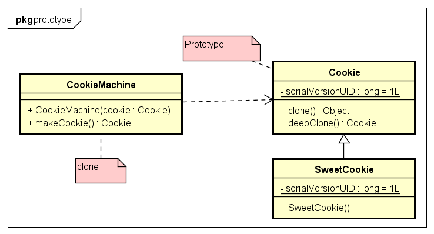

# Prototype 原型模式

- 原型模式:
原型模式是创建型模式的一种,其特点在于通过「复制」一个已经存在的实例来返回
新的实例,而不是新建实例。被复制的实例就是我们所称的「原型」，这个原型是可
定制的。
原型模式多用于创建复杂的或者耗时的实例，因为这种情况下，复制一个已经存在
的实例使程序运行更高效；或者创建值相等，只是命名不一样的同类数据。


示例类图:


示例代码:
```java
// Prototype Class
public class Cookie implements Cloneable, Serializable {
	private static final long serialVersionUID = 1L;
	protected String type = "饼干";

	@Override
	public String toString() {
		return "[type=" + type + "] " + hashCode();
	}

	// 浅复制
	@Override
	public Object clone() throws CloneNotSupportedException {
		return (Cookie) super.clone();
	}

	// 深复制
	public Cookie deepClone() {
		try {
			// 写入当前对象的二进制流
			ByteArrayOutputStream bos = new ByteArrayOutputStream();
			ObjectOutputStream oos = new ObjectOutputStream(bos);
			oos.writeObject(this);
			// 读出二进制流产生的新对象
			ByteArrayInputStream bis = new ByteArrayInputStream(bos.toByteArray());
			ObjectInputStream ois = new ObjectInputStream(bis);
			return (Cookie) ois.readObject();
		} catch (Exception e) {
			e.printStackTrace();
		}
		return null;
	}
}
public class SweetCookie extends Cookie {
	private static final long serialVersionUID = 1L;

	public SweetCookie() {
		this.type = "小甜饼";
	}
}


// Client
public class CookieMachine {
	private Cookie cookie;// cookie必须是可复制的

	public CookieMachine(Cookie cookie) {
		this.cookie = cookie;
	}

	public Cookie makeCookie() {
		try {
			return (Cookie) cookie.clone();
		} catch (CloneNotSupportedException e) {
			e.printStackTrace();
		}
		return null;
	}

	public static void main(String args[]) {
		List<Cookie> cookies = new LinkedList<Cookie>();
		Cookie prototype = new SweetCookie();
		CookieMachine cm = new CookieMachine(prototype); // 设置原型
		for (int i = 0; i < 5; i++) {
			// 通过复制原型返回多个cookie
			cookies.add(cm.makeCookie());
		}
		System.out.println(cookies);
	}
}

```

- 浅复制：
> 将一个对象复制后，基本数据类型的变量都会重新创建，而引用类型，指向的还是原对象所指向的。
- 深复制：
> 将一个对象复制后，不论是基本数据类型还有引用类型，都是重新创建的。简单来说，就是深复制进行了
完全彻底的复制，而浅复制不彻底。