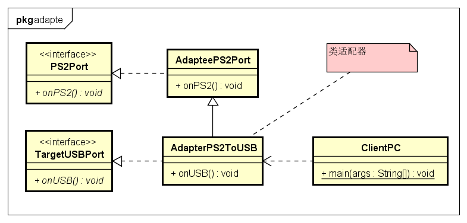
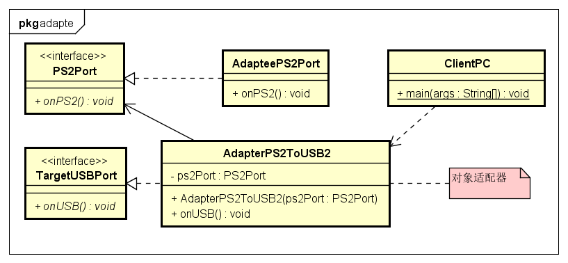

# Adapter 适配器模式

- 适配器:
也称包装样式或者包装(wrapper)。将一个类的接口转接成用户所期待的。
一个适配使得因接口不兼容而不能在一起工作的类工作在一起，做法是将类自己的接口包裹在一个已存在的类中。

- 主要分为三类：类的适配器模式、对象的适配器模式、接口的适配器模式。
**类适配器**是通过类的继承实现的适配;
**对象适配器**是通过对象间的关联关系,组合关系实现的适配;
**接口适配器**用一个抽象类实现该接口所有方法,在继承该抽象类重写想要的方法。

- 适配器模式说明
1. Target 目标角色 该角色定义把其他类转换为何种接口，也就是我们的期望接
口。
2. Adaptee 源角色 你想把“谁”转换成目标角色，这个“谁”就是源角色，它是已经存
在的、运行良好的类或对象。
3. Adapter 适配器角色 适配器模式的核心角色，其他两个角色都是已经存在的角
色，而适配器角色是需要新建立的，他的职责非常简单：把源角色转换为目标
角色。

- 适配器模式优点
1. 适配器模式可以让两个没有任何关系的类在一起运行，只要适配器这个角色能
够搞定他们就成。
2. 增加了类的透明性。我们访问的是目标角色，但是实现却在源角色里。
3. 提高了类的复用度。源角色在原有系统中还是可以正常使用的。
4. 灵活性非常好。不想要适配器时，删掉这个适配器就好了，其他代码不用改。

 类适配器示例类图:


- 类适配器示例代码:
```java
//Target 目标接口，或称为标准接口
public interface TargetUSBPort {
	public void onUSB();
}
// PS2圆接口
public interface PS2Port {
	public void onPS2();
}

// Adaptee 具有特殊功能、但不符合我们现有的标准接口的类
public class AdapteePS2Port implements PS2Port {
	@Override
	public void onPS2() {
		System.out.println("PS2接口的键盘...");
	}
}

// Adapter 适配器类，继承了被适配类，同时实现标准接口。(类适配器)
public class AdapterPS2ToUSB extends AdapteePS2Port implements TargetUSBPort {
	@Override
	public void onUSB() {
		System.out.println("类适配器 转换...");
		this.onPS2();
	}
}

// Client
public class ClientPC {
	public static void main(String[] args) {
		// 类适配器
		TargetUSBPort adapter = new AdapterPS2ToUSB();
		adapter.onUSB();
	}
}
```

- 对象适配器示例类图:


- 对象适配器示例代码:
```java
//Target 目标接口，或称为标准接口
public interface TargetUSBPort {
	public void onUSB();
}
// PS2圆接口
public interface PS2Port {
	public void onPS2();
}

// Adaptee 具有特殊功能、但不符合我们现有的标准接口的类
public class AdapteePS2Port implements PS2Port {
	@Override
	public void onPS2() {
		System.out.println("PS2接口的键盘...");
	}
}

// Adapter 适配器类，直接关联被适配类。(对象适配器)
public class AdapterPS2ToUSB2 implements TargetUSBPort {
	private PS2Port ps2Port;

	// 通过构造函数传入具体需要适配的被适配类对象
	public AdapterPS2ToUSB2(PS2Port ps2Port) {
		this.ps2Port = ps2Port;
	}

	@Override
	public void onUSB() {
		System.out.println("转换...");
		// 使用委托的方式完成特殊功能
		ps2Port.onPS2();
	}
}

// Client
public class ClientPC {
	public static void main(String[] args) {
		// 对象适配器
		PS2Port adaptee = new AdapteePS2Port();
		TargetUSBPort adapter2 = new AdapterPS2ToUSB2(adaptee);
		adapter2.onUSB();
	}
}
```

- 接口适配器示例:
可以让用户更加方便的使用该接口,比如一个接口有很多方法,而只需要实现其中一两个方法,其他方法也不得不实现带来不必要的麻烦。
在GUI编程是经常遇到这类问题，比如 java.awt.event.WindowListener 有7个方法
windowOpened(WindowEvent)
windowClosing(WindowEvent)
windowClosed(WindowEvent)
windowIconified(WindowEvent)
windowDeiconified(WindowEvent)
windowActivated(WindowEvent)
windowDeactivated(WindowEvent)
所以提供了
java.awt.event.WindowAdapter implements WindowListener, WindowStateListener, WindowFocusListener
WindowAdapter方便了我们编写代码,只需要继承重写想要的方法即可。
