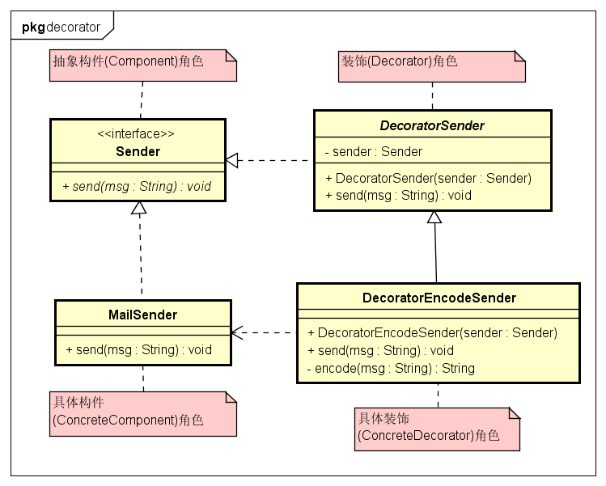

# Decorator 装饰模式

- 装饰模式:
装饰模式又名包装(Wrapper)模式。装饰模式以对客户端透明的方式扩展对象的功能，是继承关系的一个替代方案。
给一个对象增加一些新的功能，而且是动态的，要求装饰对象和被装饰对象实现同一个接口，装饰对象持有被装饰对象的实例。
就功能而言，修饰模式相比生成子类更为灵活，这样可以给某个对象而不是整个类添加一些功能。

它主要是解决：
> “过度地使用了继承来扩展对象的功能”，由于继承为类型引入的静态特质，使得这种扩展方式缺乏灵活性；
并且随着子类的增多（扩展功能的增多），各种子类的组合（扩展功能的组合）会导致更多子类的膨胀（多继承）。
继承为类型引入的静态特质的意思是说以继承的方式使某一类型要获得功能是在编译时。
所谓静态，是指在编译时；动态，是指在运行时。

- 示例类图:


- 示例代码:
```java
// Component
public interface Sender {
	public void send(String msg);
}
// ConcreteComponent
public class MailSender implements Sender {
	@Override
	public void send(String msg) {
		System.out.println("MailSender send : " + msg);
	}
}
public class SmsSender implements Sender {
	@Override
	public void send(String msg) {
		System.out.println("SmsSender  send : " + msg);
	}
}

// Decorator接口或者抽象类
public abstract class DecoratorSender implements Sender {
	protected Sender sender;

	public DecoratorSender(Sender sender) {
		this.sender = sender;
	}

	@Override
	public void send(String msg) {
		sender.send(msg);
	}
	
}
// 具体实现Decorator接口或者继承抽象类的类
public class DecoratorEncodeSender extends DecoratorSender {

	public DecoratorEncodeSender(Sender sender) {
		super(sender);
	}

	@Override
	public void send(String msg) {
		super.send(encode(msg));
	}
	// 为sender对象发送的msg特殊编码
	private String encode(String msg) {
		System.out.println("编码处理...");
		return "###" + msg + "$$$";
	}
}

// 测试
public class DecoratorTest {

	public static void main(String[] args) {
		Sender sender = new MailSender();
		DecoratorSender decoratorSender = new DecoratorEncodeSender(sender);
		decoratorSender.send("邮箱信息...");
		
		new DecoratorEncodeSender(new SmsSender()).send("短信信息..");
		sender = new DecoratorEncodeSender(new SmsSender());
	}

}
```


- Decorator装饰模式的几点要点：

1. 通过采用组合、而非继承的手法，Decorator模式实现了在运行时动态的扩展对象功能的能力，
而且可以根据需要扩展多个功能。避免了单独使用继承带来的“灵活性差”和“多子类衍生问题”。

2. Component类在Decorator模式中充当抽象接口的角色，不应该去实现具体的行为。
而且Decorator类对于Component类应该透明——换言之Component类无需知道Decorator类，
Decorator类是从外部来扩展Component类的功能。

3. Decorator类在接口上表现为is-a Component的继承关系，即Decorator类继承了Component类所具有的接口。
但在实现上又表现为has-a Component的组合关系，即Decorator类又使用了另外一个Component类。
我们可以使用一个或多个Decorator对象来“装饰”一个Component对象，且装饰后的对象仍然是一个Component对象。

在这里我想谈一下我的理解：当我们实例化一个Component对象后，要给这个对象扩展功能,
这时我们把这个Component对象当作参数传给Decorator的子类的构造函数——也就是扩展方法的功能类。
对于引用类型传参时，实际上只是传递对象的地址，这样，在功能扩展是，操作的应该是同一个对象。

4. Decorator模式并非解决“多子类衍生的多继承”问题，Decorator模式应用的要点在于解决“主体类在多个方向上的扩展功能”——是为“装饰”的含义。
Decorator是在运行时对功能进行组合。

- 装饰器模式的应用场景：

1. 需要扩展一个类的功能。
2. 动态的为一个对象增加功能，而且还能动态撤销。(继承不能做到这一点，继承的功能是静态的，不能动态增删)

- 缺点：产生过多相似的对象，不易排错。